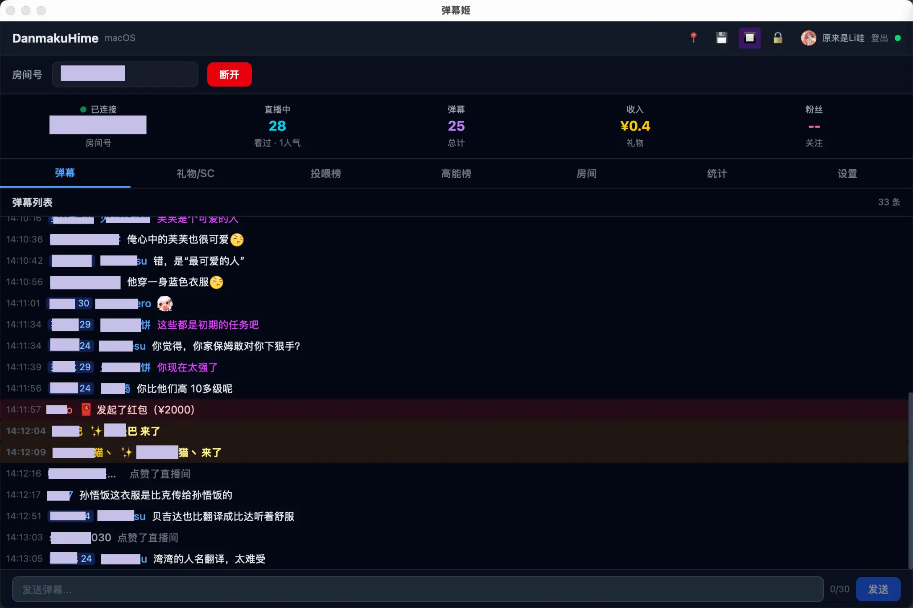

  

<h1 align="center">弹幕姬 DanmakuHime</h1>

  为 macOS 打造的直播弹幕客户端

  
  

---

## 截图

  

---

## 功能

**实时弹幕** — 毫秒级延迟接收弹幕、礼物、SC 等互动消息，不错过直播间的每一条互动。

**弹幕过滤** — 灵活的过滤规则，屏蔽刷屏和无关消息，让你只看到真正重要的观众互动。

**语音播报** — 自动朗读弹幕和礼物信息，即使在游戏中也不会错过观众的每一条互动。

**OBS 联动** — 根据直播状态自动切换画面场景，智能控制推流内容，解放你的双手。

**虚拟形象联动** — 触发模型表情和动作，让你的虚拟形象与观众实时互动。

**插件扩展** — 丰富的插件生态，按需启用，自由组合，打造属于你的直播工作流。

**轻量流畅** — 极低内存占用，秒速启动，安静运行不打扰你的直播。

**深色 / 浅色主题** — 跟随系统自动切换，或手动选择你喜欢的外观。

---

## 下载安装

前往 [Releases](https://github.com/libra-co/danmakuhime-releases/releases) 页面下载最新的 `.dmg` 安装包。

支持 **macOS 10.15+**，同时提供 Apple Silicon（M 系列芯片）和 Intel 两个版本。

### 首次打开

由于未进行 Apple 代码签名，首次打开时 macOS 可能会提示"无法验证开发者"。请按以下步骤操作：

1. 打开 **系统设置 → 隐私与安全性**
2. 在页面底部找到关于 DanmakuHime 的提示
3. 点击 **"仍要打开"**

之后即可正常使用。

---

## 最近更新

<!-- CHANGELOG_START -->
### v0.1.0 (2025-03-23)

**首个公开版本**

### 新增功能

- **核心架构**：双总线（Event Bus + Command Router）+ 插件化架构
- **直播连接**：B站直播 WebSocket 连接与二进制协议解析
- **弹幕显示**：实时弹幕列表，支持弹幕、礼物、SC、大航海等 20+ 种事件
- **弹幕悬浮窗**：独立透明窗口，可置顶显示弹幕，支持自定义样式
- **TTS 语音播报**：macOS 原生 `say` 命令，支持自定义播报规则和过滤
- **自动回复**：基于关键词/正则匹配的自动回复系统
- **弹幕发送**：支持在客户端直接发送弹幕
- **弹幕记录**：SQLite 本地存储，支持导出 TXT/JSON 格式
- **OBS 联动**：内置 OBS 浏览器源 HTTP 服务，支持 WebSocket 场景切换
- **VTube Studio 联动**：支持 VTS 表情触发
- **定时广告**：可配置的定时弹幕发送
- **直播间控制**：禁言、封禁等房管功能
- **配置管理**：支持配置导入/导出，一键迁移
- **深色/浅色主题**：跟随系统或手动切换
- **系统托盘**：关闭窗口最小化到托盘，托盘菜单快捷操作
- **窗口置顶**：一键置顶/取消置顶
- **防 OOM 机制**：分通道缓冲桶与自适应背压
- **扫码登录 + Cookie 登录**：两种登录方式

### 技术细节

- Tauri v2 + Rust + React + TypeScript
- 11 个独立业务插件，支持依赖解析与拓扑排序
- 细粒度状态树（Atomic + 独立 RwLock）
- macOS 原生体验，极低内存占用
- 前端 Terser 混淆压缩，Rust release profile 优化（LTO + strip symbols）
<!-- CHANGELOG_END -->

查看完整更新日志：[CHANGELOG.md](CHANGELOG.md)

---

## 关于作者

**Libra** — B站主播 & 独立开发者

- B站：[@原来是Li哇](https://space.bilibili.com/26190537)
- 直播间：[live.bilibili.com/4536023](https://live.bilibili.com/4536023)
- 官网：[danmakuhime-8qjbmg8b.manus.space](https://danmakuhime-8qjbmg8b.manus.space)

---

## 反馈与建议

如果你在使用中遇到问题或有功能建议，欢迎通过以下方式联系：

- 在 [Issues](https://github.com/libra-co/danmakuhime-releases/issues) 中提交反馈
- 到 [直播间](https://live.bilibili.com/4536023) 直接告诉我
