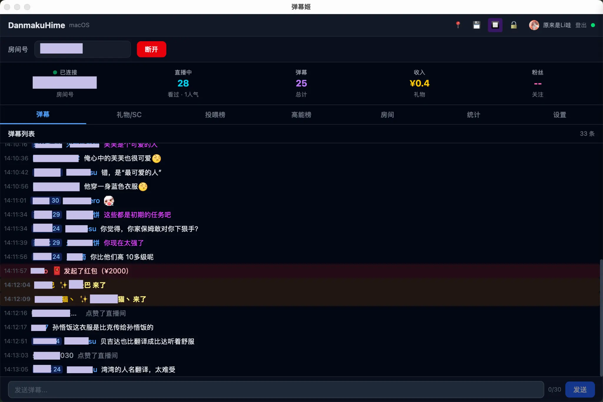

  

<h1 align="center">弹幕姬 DanmakuHime</h1>

  为 macOS 打造的直播弹幕客户端

  
  

---

## 截图

  

---

## 功能

**实时弹幕** — 毫秒级延迟接收弹幕、礼物、SC 等互动消息，不错过直播间的每一条互动。

**弹幕过滤** — 灵活的过滤规则，屏蔽刷屏和无关消息，让你只看到真正重要的观众互动。

**语音播报** — 自动朗读弹幕和礼物信息，即使在游戏中也不会错过观众的每一条互动。

**OBS 联动** — 根据直播状态自动切换画面场景，智能控制推流内容，解放你的双手。

**虚拟形象联动** — 触发模型表情和动作，让你的虚拟形象与观众实时互动。

**插件扩展** — 丰富的插件生态，按需启用，自由组合，打造属于你的直播工作流。

**轻量流畅** — 极低内存占用，秒速启动，安静运行不打扰你的直播。

**深色 / 浅色主题** — 跟随系统自动切换，或手动选择你喜欢的外观。

---

## 下载安装

前往 [Releases](https://github.com/libra-co/danmakuhime-releases/releases) 页面下载最新的 `.dmg` 安装包。

支持 **macOS 10.15+**，同时提供 Apple Silicon（M 系列芯片）和 Intel 两个版本。

### 首次打开

由于未进行 Apple 代码签名，首次打开时 macOS 可能会提示"无法验证开发者"。请按以下步骤操作：

1. 打开 **系统设置 → 隐私与安全性**
2. 在页面底部找到关于 DanmakuHime 的提示
3. 点击 **"仍要打开"**

之后即可正常使用。

---

## 最近更新

<!-- CHANGELOG_START -->
### v0.2.0 · 2026-07-25

### ✨ 新功能

- **一键开播**：在软件里选好分区就能开播，自动拿到推流地址和密钥，复制到 OBS 即可直播；遇到需要实名认证时会给出认证入口
- **断网自动补弹幕**：直播中网络中断，期间错过的弹幕、礼物和醒目留言会在重连后自动补回，不再漏掉重要互动
- **语音播报更聪明**：可以设置先念什么（比如礼物、观众发言优先），人多的时候不再被「欢迎进入直播间」刷屏；还能调节播报音量
- **更好看的 OBS 弹幕**：内置深色、透明描边、浅色三套样式，也能自己写样式；「透明描边」样式无需抠图就能叠加到直播画面上
- **悬浮窗直接发弹幕**：弹幕悬浮窗底部新增输入框，看弹幕的同时随手回复
- **刷屏弹幕自动折叠**：连续重复的弹幕合并成一条并显示数量；还能用关键词或规则屏蔽指定弹幕
- **直播间屏蔽词管理**：在软件里增删直播间屏蔽词，命中的弹幕对所有观众隐藏
- **防录屏窗口**：主窗口和弹幕悬浮窗可设为在录屏、截图、推流采集里隐藏，只有你自己看得到

### 🛠 优化与修复

- 禁言时长改为按小时设置，更符合 B站 规则
- 适配 B站 新版的进场、关注、高能榜消息，修复相关信息不显示
- 修复部分表情显示不出来
- 修复网络短暂波动后弹幕列表、数据统计被清空
- 修复醒目留言、大航海等付费互动有时不显示
- 修复长时间直播后数据统计停止更新
- 开播、断线重连等场景更稳定

---

### v0.1.2 · 2026-03-29

- 更新应用图标
- 修复更新提示里显示的版本号不对
- 修复个别界面出现多余的「0」

---

### v0.1.1 · 2026-03-23

- 减小安装包体积
- 修复若干界面显示细节

---
<!-- CHANGELOG_END -->

查看完整更新日志：[CHANGELOG.md](CHANGELOG.md)

---

## 关于作者

**Libra** — B站主播 & 独立开发者

- B站：[@原来是Li哇](https://space.bilibili.com/26190537)
- 直播间：[live.bilibili.com/4536023](https://live.bilibili.com/4536023)
- 官网：[danmakuhime-8qjbmg8b.manus.space](https://danmakuhime-8qjbmg8b.manus.space)

---

## 反馈与建议

如果你在使用中遇到问题或有功能建议，欢迎通过以下方式联系：

- 在 [Issues](https://github.com/libra-co/danmakuhime-releases/issues) 中提交反馈
- 到 [直播间](https://live.bilibili.com/4536023) 直接告诉我
